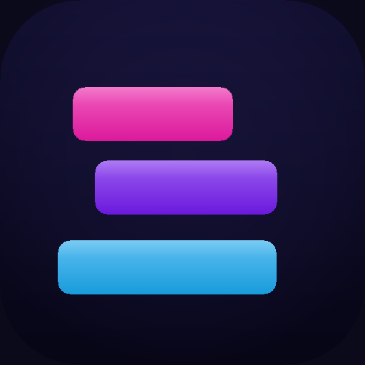

# Neon Stack 🎮

A one-tap **tower-stacking game** built for the iPhone — pure HTML5 + JavaScript,
no build step, no dependencies, no app store required. Runs in Safari and can be
installed to the home screen like a native app.



## Play it

**On your iPhone (recommended):**

1. Host the folder somewhere your phone can reach it (see [Running it](#running-it)).
2. Open the URL in **Safari**.
3. Tap the **Share** button → **Add to Home Screen**. It launches full-screen,
   with its own icon, and works offline.

**On a computer:** just open `index.html` in any modern browser. Tap / click
(or press **Space**) to drop blocks.

## How to play

- A block slides back and forth above the tower. **Tap anywhere** to drop it.
- The part that hangs over the edge is sliced off — line blocks up to keep your
  tower wide.
- Land a block **perfectly** and it regrows a little and starts a **combo
  streak** (`PERFECT ×2`, `×3`, …) worth bonus points.
- Miss the tower completely and it's game over. Your best height is saved on
  your device.

## Running it

Any static file server works. From this folder:

```bash
# Python (built in on macOS)
python3 -m http.server 8000
# then open http://<your-computer-ip>:8000 on your iPhone
```

To put it online for free, drop the folder onto GitHub Pages, Netlify, Vercel,
or Cloudflare Pages — it's all static files.

> A service worker (`sw.js`) caches the game so it keeps working with no
> connection once loaded. During local development, if changes don't show up,
> do a hard refresh or unregister the service worker in your browser's dev tools.

## What's in here

| File | Purpose |
|------|---------|
| `index.html` | The entire game — markup, styles, and logic in one file. |
| `manifest.webmanifest` | Makes it installable as a Progressive Web App. |
| `sw.js` | Service worker for offline play. |
| `favicon.png`, `icons/` | App + browser icons. |
| `scripts/make_icons.py` | Regenerates the icons (pure Python, no dependencies). |
| `scripts/test_game.mjs` | Headless Playwright test that actually plays the game. |

## Development

Regenerate icons after tweaking the artwork:

```bash
python3 scripts/make_icons.py
```

Run the automated gameplay test (drives the game in a headless browser, checks
that it starts, stacks, scores, ends, and persists the best score, and fails on
any JS error):

```bash
npm install playwright   # once
node scripts/test_game.mjs
```

## Want a real App Store app?

This web version is the fast path and is genuinely fun to play. If you later
want to ship to the App Store, the same game can be wrapped natively — but that
step needs a **Mac with Xcode** and an Apple Developer account. The gameplay,
art direction, and feel are already worked out here to build on.
